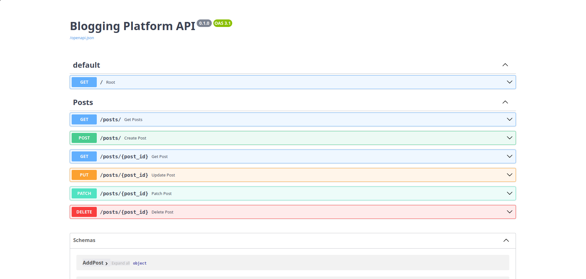

_This project was created as part of my learning python language_

# blogging-platform-api

## Description
A simple RESTful API with basic CRUD operations for a personal blogging platform.

## API Documentation



## Project Goals

- Undertand what the RESTful APIs are including best practices and conventions
- Learn how to create a RESTful API
- Learn about common HTTP methods like GET, POST, PUT, PATCH, DELETE
- Learn about status codes amd error handling in APIs
- Learn how to perform CRUD operations using an API
- Learn how to work with databases

## Instructions

### Requirements

* Python 3.X installed

### Setup

1. Clone the repository:

```
git clone git@github.com:emersonalbino20/blogging-platform-api.git
```

2. Navigate to the project directory:

```
cd blogging-platform
```

3. Create a virtual environment:

```
python3 -m venv .venv
```

4. Active the virtual enviroment:

```
source .venv/bin/activate
```

5. Install dependecies:

```
pip install -r requirements.txt
```

6. Run the server

```
python3 main.py
```

7. Open the API documentation in your browser:

```
http://127.0.0.1:8080/docs
```

## Project structure

```
blogging-platform-api/
├── README.md
├── LICENSE
├── images
│   └── swagger-ui.py
├── database
│   ├── blog.db
│   └── database_conf.py
├── requirements.txt
├── main.py
├── models
│   └── post.py
├── routes
│   └── post.py
├── requirements.txt
├── services
│   ├── auth_service.py
│   ├── report_service.py
│   └── user_service.py
└── utils
   └── validate.py
```

## API Features

The API allows users to perform the following operations:

* Create a new blog post
* Update an existing blog post
* Delete an existing blog post
* Get a single blog post
* Get all blog posts
* Filter vlog posts by a search term

### Create Blog Post

Create a new blog post using POST method

```plaintext
POST /posts
{
  "title": "My First Blog Post",
  "content": "This is the content of my first blog post.",
  "category": "Technology",
  "tags": ["Tech", "Programming"]
}
```

## Resources

* https://roadmap.sh/python

* https://roadmap.sh/projects/blogging-platform-api

* https://youtu.be/xq1Snezb1rs?si=lQZZip9tnKZ2r6YB

* https://youtu.be/DwBDHsdX6XQ?si=VcayHy5gcvZI_F_F

* https://fastapi.tiangolo.com/tutorial/query-params/

## Contact

Email: ealbino@student.42luanda.com

LinkedIn:  https://www.linkedin.com/in/emerson-albino-241390251/

## AI Usage

AI tools were used as educational support during the development of this project for:

* Understanding RESTful API concepts.
* Assisting with documentation interpretation.
* Reviewing and improving project documentation.

No code was copied directly without analysis and adaptation by the author.


